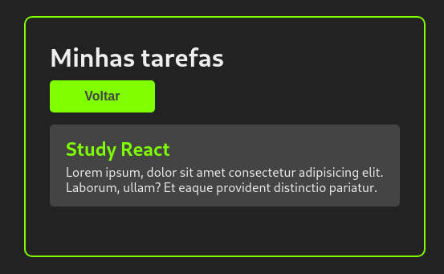

[todo-app-react](https://6165f5f274baa3000985c5f7--serene-davinci-d38629.netlify.app/)
======================================================================================

Simple to-do list application made in React for studying purposes.

Used technologies
-----------------

*   The application consumes an API to get the tasks initially.
*   **React used in the frontend**

Features
--------

### Functional requirements

*   List tasks
*   See task info
*   Add task
*   Delete task

### Non functional requirements

*   Simple API consumption
*   Use React for the frontend

  
  

Screens
-------

### Home

### Task Details

Requirements
------------

*   Node.js
*   Internet connection
*   Internet browser
*   A terminal emulator

How to run
----------

*   Download the project from GitHub
*   Extract project folder if needed
*   Go to the project folder and open a terminal emulator (Gnome Terminal, CMD...)
*   Type 'npm start' and hit enter

### or

[Click-me!](https://6165f5f274baa3000985c5f7--serene-davinci-d38629.netlify.app/)